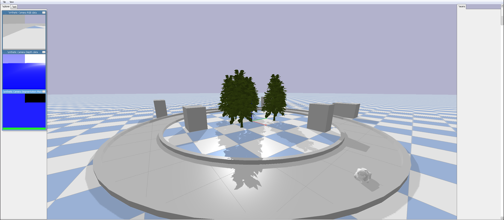

<<<<<<< HEAD
# AWS Deepracer Simulation with ROS2 Foxy



## Introduction

This repository provides the tools and instructions necessary to simulate and control an AWS Deepracer using ROS2 on Ubuntu 20.04. It includes integration with PyBullet for physics-based simulations.

### Sources

- Object models sourced from [ChenEating716/pybullet-URDF-models](https://github.com/ChenEating716/pybullet-URDF-models).
- AWS Deepracer models and details from [aws-deepracer](https://github.com/aws-deepracer/aws-deepracer/tree/main).

## Environment Setup for ROS2 Foxy on Ubuntu 20.04

This guide will help you set up the necessary environment for working with ROS2 Foxy.

### Step 1: Install ROS2 Foxy

1. Update your package list:
    ```bash
    sudo apt update
    ```

2. Install ROS2 Foxy Base and other necessary packages:
    ```bash
    sudo apt install ros-foxy-ros-base python3-argcomplete
    ```

3. Install `colcon`, a command line tool to build ROS2 packages:
    ```bash
    sudo apt install python3-colcon-common-extensions
    ```

4. Install build essential tools:
    ```bash
    sudo apt install build-essential
    ```

5. Install Gazebo, a robust simulator for robotic applications:
    ```bash
    sudo apt install gazebo11 libgazebo11-dev
    ```

6. Install ROS packages for Gazebo:
    ```bash
    sudo apt install ros-foxy-gazebo-ros-pkgs
    ```

7. Install Python pip:
    ```bash
    sudo apt install python3-pip
    ```

### Step 2: Configure Environment

1. Open your `.bashrc` file for editing:
    ```bash
    nano ~/.bashrc
    ```

2. Add Gazebo and ROS2 to your environment setup:
    ```bash
    echo "source /usr/share/gazebo/setup.sh" >> ~/.bashrc
    echo "source /opt/ros/foxy/setup.bash" >> ~/.bashrc
    ```

3. Set the ROS Domain ID (useful for running multiple ROS2 applications within the same network):
    ```bash
    echo "export ROS_DOMAIN_ID=0" >> ~/.bashrc
    ```

4. Reload your `.bashrc` to apply the changes:
    ```bash
    source ~/.bashrc
    ```

### Step 3: Install Additional Python Libraries

Install necessary Python libraries for running simulations:

1. Install PyBullet, a Python module for physics simulation in robotics, games, and animations:
    ```bash
    pip3 install pybullet
    ```

2. Upgrade NumPy, a fundamental package needed for scientific computing with Python:
    ```bash
    pip3 install --upgrade numpy
    ```

3. Install transforms3d, a library to manage three-dimensional geometric transformations:
    ```bash
    pip3 install transforms3d
    ```

4. Install Matplotlib, a plotting library for Python and its numerical extension NumPy:
    ```bash
    pip3 install matplotlib
    ```

After completing these steps, your system should be ready to run ROS2 Foxy simulations in conjunction with Gazebo and other necessary Python libraries.

### Running Simulations
1. To start a simulation with the AWS Deepracer:
    ```bash
    ros2 run deepracer_nodes bullet_one_camera
    ```
### Teleoperating the Deepracer
2. To control the Deepracer using the keyboard, execute:
    ```bash
    ros2 run teleop_twist_keyboard teleop_twist_keyboard
    ```

### ROS Topics and Commands
3. List all active ROS topics with:
    ```bash
    ros2 topic list
    ```

4. To view the output of a specific topic in real-time:
    ```bash
    ros2 topic echo <topic name>
    ```
=======
# DeepRacer_Simulator
>>>>>>> 82d80fe50c9e770203a7b39bf571132ac26a6f4e
